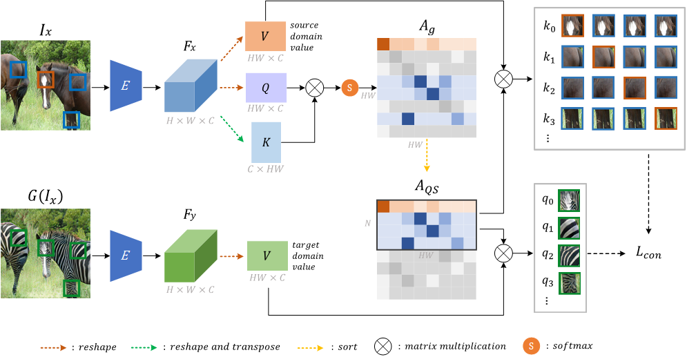

# QS-Attn: Query-Selected Attention for Contrastive Learning in I2I Translation (CVPR2022)

>Unpaired image-to-image (I2I) translation often requires to maximize the mutual information between the source and the translated images across different domains, which is critical for the generator to keep the source content and prevent it from unnecessary modifications. The self-supervised contrastive learning has already been successfully applied in the I2I. By constraining features from the same location to be closer than those from different ones, it implicitly ensures the result to take content from the source. However, previous work uses the features from random locations to impose the constraint, which may not be appropriate since some locations contain less information of source domain. Moreover, the feature itself does not reflect the relation with others. This paper deals with these problems by intentionally selecting significant anchor points for contrastive learning. We design a query-selected attention (QS-Attn) module, which compares feature distances in the source domain, giving an attention matrix with a probability distribution in each row. Then we select queries according to their measurement of significance, computed from the distribution. The selected ones are regarded as anchors for contrastive loss. At the same time, the reduced attention matrix is employed to route features in both domains, so that source relations maintain in the synthesis. We validate our proposed method in three different I2I datasets, showing that it increases the image quality without adding learnable parameters.

 

 
QS-Attn applies attention to select anchors for contrastive learning in single-direction I2I task

## Getting Started
### Prerequisites
- Ubuntu 16.04
- NVIDIA GPU + CUDA CuDNN
- Python 3

## Pretrained Models
Coming soon!

## Training
Coming soon!

## Inference
Coming soon!

## Citation
If you use this code for your research, please cite
